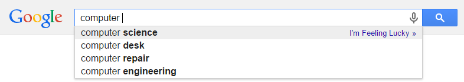

Autocomplete is an algorithm used in many modern software applications. In all of these applications, the user types text and the application suggests possible completions for that text:

While finding terms that contain a query is trivial, these applications need some way to select only the most useful terms to display (since users will likely not comb through thousands of terms, nor will obscure terms like "antidisestablishmentarianism" be useful to most users). Thus, autocomplete algorithms not only need a way to find terms that start with or contain the prefix, but a way of determining how likely each one is to be useful to the user and filtering the most useful out. 

Autocomplete does not just need to suggest useful terms, but according to one study, must do so in at most 50 milliseconds. Any longer, and the user will already be inputting the next keystroke (while humans do not on average input one keystroke every 50 milliseconds, additional time is required for server communication, input delay, and other processes). Furthermore, the server must be able to run this computation for every keystroke, and for every user.

In this assignment, you will be implementing autocomplete using several different algorithms and seeing which ones are faster in certain scenarios. Our autocomplete will be different than the industrial examples described above in two ways:
<li>First off, each term will have a predetermined, constant weight/likelihood, whereas actual autocomplete algorithms might change a term's likelihood based on previous searches.</li>
<li>Second, we will only consider terms which start with the user query, whereas actual autocomplete algorithms (such as the web browser example above) might consider terms which contain but do not start with the query.</li>