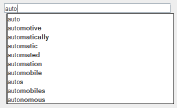

The <code><a href="code/Term.html">Term</a></code> class serves two purposes. 
<ol>
<li> The basic purporse is to encapsulate a term-weight pair. </li>
<li> More importantly, Term allows us to use Comparable and Comparator to sort terms in a variety of ways, which will make Autocompletor implementations much simpler. It is very difficult to write our Autocompletor implementations without having Term written, so you should complete this class first.</li>
</ol>

Within this class, you should:
<li> Implement the constructor </li>
<li> Implement the (nearly identical) inner Comparator classes WeightOrder and ReverseWeightOrder</li>
<li> Implement the inner Comparator class PrefixOrder </li>

Notice that the methods <tt>compareTo</tt>, <tt>getWord</tt>,
<tt>getWeight</tt>, and <tt>toString</tt> are already completed for
you. Most importantly, notice that <tt>compareTo</tt> sorts by lexicographic order
using the word parameter. This functionality will be utilized in
<code><a href="code/BinarySearchAutocomplete.html">BinarySearchAutocomplete</a></code>.

###The Constructor
The constructor simply needs to take the input arguments and store them to the class variables. Make sure you throw the exceptions listed in the method header when required. 

###WeightOrder and ReverseWeightOrder
For these comparators, all you need to do is write the compare method for each of them. Remember, compare(a, b) should return a negative value when a comes before b in the desired order.

###PrefixOrder
PrefixOrder is a bit more interesting. PrefixOrder is initialized with an integer argument r. PrefixOrder should sort terms lexicographically, **but only using the first r letters**. So, while “beeswax” comes after “beekeeper” using lexicographical sorting, the two words would be considered equal using PrefixOrder with r = 3.

For words shorter than r letters, we still use lexicographical ordering. So, “bee” still comes before “beeswax” using PrefixOrder(4), since “bee” would come before “bees” and similarly “bug” would come after “beeswax” using PrefixOrder(4) since “bees” would come before “bug” in lexicographic order.

Since only the first r letters of any word are relevant in PrefixOrder(r), <strong>for full credit PrefixOrder(r).compare(v, w) should take O(r) to run, independent of the length of v and w</strong>. 

PrefixOrder may seem arbitrary and maybe even useless at first, but when
you implement <code><a href="code/BinarySearchAutocomplete.html">BinarySearchAutocomplete</a></code>, it will prove rather useful.

###After Term Is Written
Once Term is written, the provided BruteAutocomplete class should be fully functional. Try setting AUTOCOMPLETOR\_CLASS\_NAME to BRUTE_AUTOCOMPLETE in AutocompleteMain and running it. If you load words-333333.txt and type in "auto" you should get the following result:

BruteAutocomplete only uses Term.WeightOrder, so getting the above result does not necessarily mean all your Comparators are working correctly.

Since the Comparators are inner classes, to initialize them in other classes, use the following syntax:

<pre><tt>
new Term.WeightOrder(); 
new Term.ReverseWeightOrder(); 
new Term.PrefixOrder(r); 
</tt></pre>
