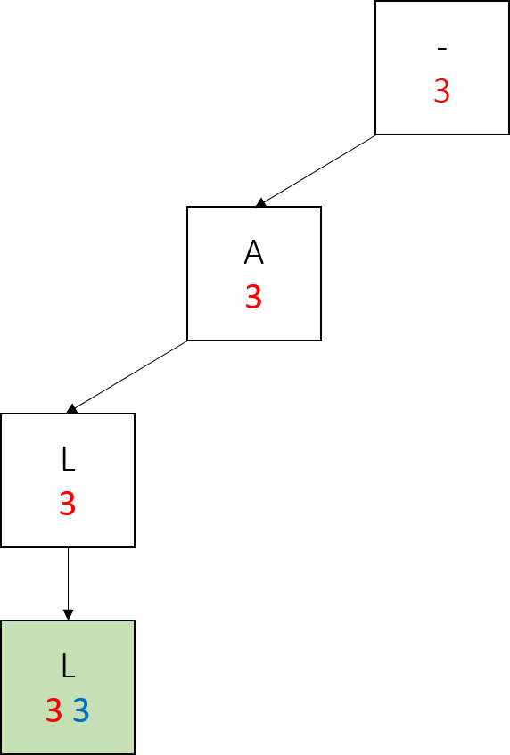
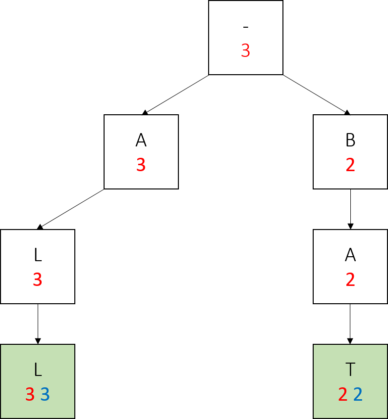
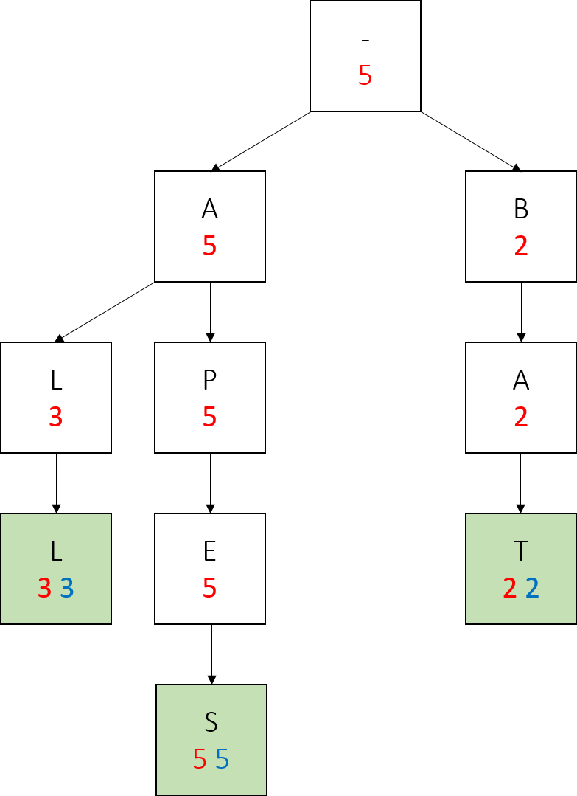
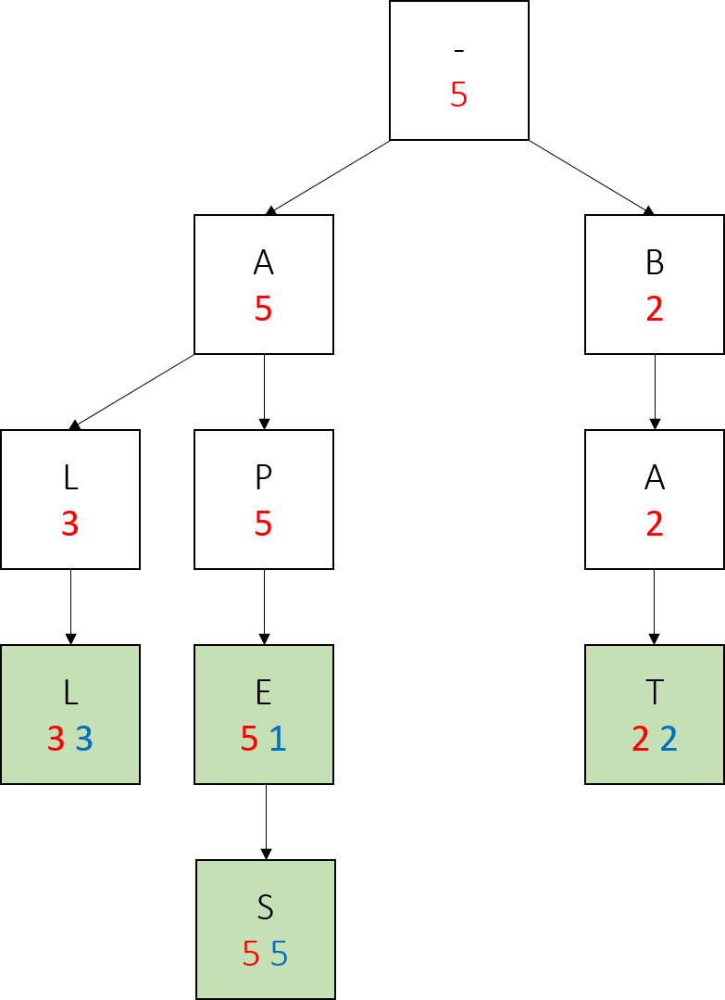
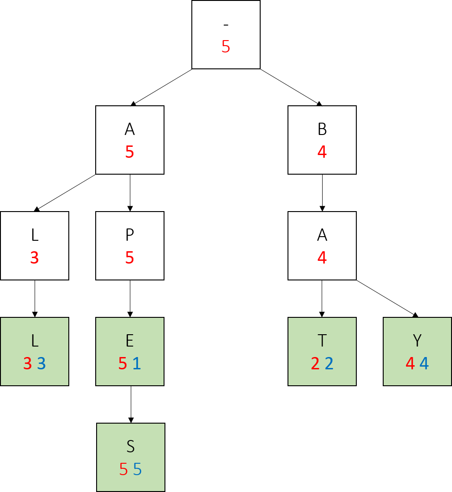

<code><a href="code/TrieAutocomplete.html">TrieAutocomplete</a></code>
implements the <code><a href="code/Autocompletor.html">Autocompletor</a></code> interface, which means it should, given a list of terms and weights for those terms, be able to find the top match(es) for a prefix amongst those terms. To do this, you will write methods to construct a trie, and then use the trie structure to quickly filter out all terms starting with a given prefix, and then find the highest weighted terms.

Within this class, you should:
<ol>
<li>Write the trie method add</li>
<li>Write the interface-required method topMatch </li>
<li>Write the interface-required method topKMatches</li>
</ol>

###The Node Class
For this entire page, it may be useful to have the <code><a
href="code/Node.html">Node</a></code> class given to you open for
reading. In addition, you should be comfortable with the basic concepts of a trie at this point.

The Node class comes with several class variables for your use in completing TrieAutocomplete:
<li>isWord - Set to true if the current node corresponds to a word in the set of words represented by this trie. We need this because in creating the nodes representing words, we create nodes representing words that do not exist (e.g. in creating a node for "apple" we will create a node for "appl"). Thus, we need some way to distinguish between intermediary nodes (nodes between the root and word nodes that don't represent words) and word nodes.</li>
<li>myWord - A convenience variable, which contains the word this node represents. Should be null if isWord is false</li>
<li>myInfo - A convenience variable, which contains the character this node corresponds to</li>
<li>myWeight - The weight of the word this node corresponds to. -1 if this node does not correspond to a word. </li>
<li>mySubtreeMaxWeight - The maximum weight of a word in the subtree rooted at this node (the subtree includes the root node). Useful for navigating quickly to high-weight nodes. Tracking this extra piece of information will heavily speed up our autocomplete algorithm. </li>
<li>children - The map from characters to the corresponding children nodes</li>
<li>parent - A pointer to the parent of this node</li>

###Add

Look at the constructor for <code><a href="code/TrieAutocomplete.html">TrieAutocomplete</a></code>. It initialize the trie's root, and then calls the void add method on every word-weight pair in the arguments for the constructor. Your task is to write the add method such that it constructs the trie correctly. That is, if you write the method correctly, then every word-weight pair should be represented as a trie, and the descriptions of the class variables for Nodes listed above should be true for every node. More specifically, when add is called on a word-weight pair, you should:
<li>Create the node representing that word and any intermediary nodes if they do not already exist</li>
<li>Set the values of myWord, myInfo, isWord, and myWeight for all word nodes</li>
<li>Set the values of mySubtreeMaxWeight for all nodes between and including the root and the word node</li>

To help you understand what all your add method should be doing, here's an example of a series of adds. In the trie below, each node's mySubtreeMaxWeight is red, the key to that node is the letter inside of it, and if the node represents a word, it has a green background and its weight is in blue.

We start with just a root:

We call add("all", 3). Notice how since the only word at this point has weight 3, all nodes have mySubtreeMaxWeight 3.

We call add("bat", 2). Only the nodes in the right subtree have mySubtreeMaxWeight 2, because the largest weight is still 3. 

We call add("apes", 5). This time, we don't create a node for the first letter. We update the mySubtreeMaxWeight of the root and the "a" node.

We call add("ape", 1). Notice how we create no new nodes, simply modify the values of an existing node.

Lastly we call add("bay", 4). Notice the changes in red numbers, and that we only created one new node here.

Also note how in the final tree, any word which has no larger-weight words below it (every word but apes) has the same red and blue values. This is true of any trie we construct in this project, if the parameters of nodes are updated correctly - a node with the same myWeight and mySubtreeMaxWeight has no children with a larger weight.

Most importantly, notice how on the path from a node representing a prefix to the largest weighted word in the subtree rooted at that node, all the red values are the same, and this value is also the weight of the largest weighted word. We will take advantage of this fact when writing topMatch().

This example of constructing a trie using add is a more simple one - we never added a word below an existing word, or a word which already exists. Your add should be able to handle any series of calls on word-weight pairs appropriately, including corner cases.

The most notable corner case is adding a word that already in the trie, but with a lower weight - for example, if we were to call add("apes", 1). In this case, we would have to update the weight of apes, and then the mySubtreeMaxWeight of all its ancestors. This is especially tricky because not all the ancestors would not have the same new value. Be sure to take advantage of parent pointers when writing code specific to this case.

###TopMatch
Fortunately, once add is written topMatch() becomes very simple. As noted in the above example, the mySubtreeMaxWeight of every node from a prefix node to the node under the prefix node with the highest weight will be the same as that highest weight. Thus, the algorithm to find the top match is simply:

<li>Navigate to the node corresponding to the prefix</li>
<li>Use the mySubtreeMaxWeight of the prefix node to navigate down the tree until you find the Node with the max weight</li>

###TopKMatches
topKMatches() is similar, but not quite the same as topMatch(). We will still be taking advantage of mySubtreeMaxWeight to quickly navigate to high-weight nodes, but this time, we will have to go down multiple branches instead of just one.

To find the top k matches as quickly as possible, we will use what is known as a search algorithm - keep a PriorityQueue of Nodes, sorted by mySubtreeMaxWeight. Start with just the root in the PriorityQueue, and pop Nodes off the PriorityQueue one by one. 

Anytime we pop a node off the PriorityQueue, or "visit" it, we will add all its children to the PriorityQueue. Whenever a visited node is a word, add it to a weight-sorted list of words. 

When this list has k words with weight greater than the largest mySubtreeMaxWeight in our priority queue, we know none of the nodes we have yet to explore can have a larger weight than the k words we have found. At that point, we can stop searching and return those k words. If we run out of nodes in the PriorityQueue before we find k words, that means there are not k words in the trie.
