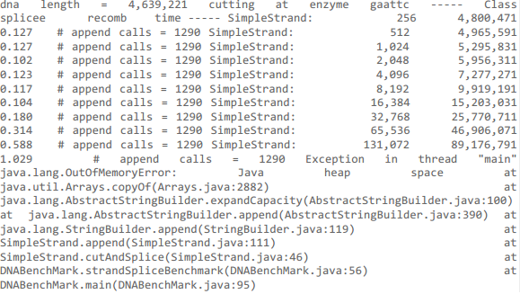
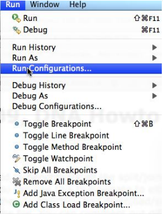
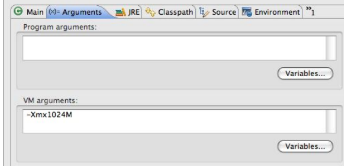

Let's see how well our SimpleStrand runs.

After snarfing the code, examine SimpleStrand's cutAndSplice method. The cutAndSplice method finds all occurrences of a restriction enzyme like “gaattc” and splices in a new strand of DNA, represented by parameter `splicee` to create a recombinant strand. The strand `splicee` replaces the enzyme. In the simulation the enzyme is removed each time it occurs/finds a binding site. The characters representing the enzyme are replaced by splicee. (This simulates the process of splitting the original DNA by the restriction enzyme, leaving sticky/blunt ends, and binding the new DNA to the split site. However, in the simulation the restriction enzyme is removed.) 

The simulate DNA, which is represented by the instance variable myInfo, is the target of a sequence of calls to indexOf that repeatedly searches for the next occurrence of the string parameter enzyme. As a special case, if the restriction enzyme is NOT found an empty strand is returned. In all cases the original strand is unchanged.

The code in the class DNABenchmark can be used to benchmark the cutAndSplice method. When you run it, you can select a text file that contains a DNA strand. You are given <code>ecolimed.dat</code> (a smaller strand) and <code>ecoli.dat</code> (a larger one).

We're going to need larger strands than that in this part. How? You can create DNA strand files of arbitrary length by creating a new text file and copy-pasting the information in your given files. (You could also write a program to randomly generate DNA strands of arbitrary length.)

<h2>Part a</h2>

We're going to benchmark SimpleStrand's cutAndSplice. Our algorithm is O(N) where N is the size of the recombined strand returned. Your task is to <em>generate data that displays this behavior</em>, <em>describe your process that led to this data</em>, and <em>explain your results</em>. Record your results in your Analysis.

<h2>Part b</h2>

You'll notice that when the benchmarking program runs, memory is used to create the recombinant DNA. We're going to determine the largest splicee string (string spliced into the DNA strand) that works without generating an Out Of Memory error:

We're going to first test this for a Java Virtual Machine configured with a 512M heap-size. (If your machine cannot run this, divide all the memory sizes by 2, and make a note in your README.) To change the size of the JVM heap-size in Eclipse, go to <code>Run > Run Configurations</code> and use <code>-Xmx512M</code>.

Your first task is to find the largest string fitting into this heapsize and the time it takes to do so. To make it simpler, <em>only use string lengths that are powers of 2</em>. Use the ecoli.dat input file, which has 645 cut points in an original strand of length 4,639,221 with a restriction enzyme "gaattc".

Do the same thing with 1024M of heap-size. Can you fit in the next power-of-two string? How long does it take?

In your Analysis, describe how you determined the power-of-two string you can use in both memory sizes, what it is, and the amount of time it took.

