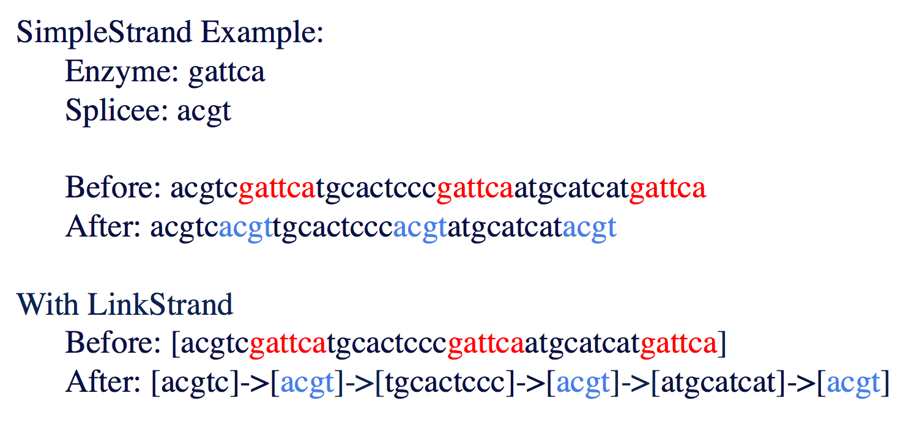

Here are a few commonly asked questions. This will be updated through the semester and through the years. 

---

###Q: 
 Can I have an example of an enzyme and a splicee? 

 

###Q: 
 When implementing my LinkStrand class and then running it through the DnaBenchmark, two of my recomb values returned as negative numbers. Any ideas why that might happen?  

###A:
 Sounds like an integer overflow, your two largest recomb strings are probably longer in length than int's max value, and if you try to store a value above the max int value, it will instead overflow to the minimum int value (a large negative number) and continue counting from there. If you want to see the larger numbers, try using a long instead (the same as an int, but has more bits and thus can store larger values).

###Q: 
 What should cutAndSplice return if the given enzyme cannot be found within the strand? 

###A:
 An empty string.

###Q: 
 How do I vary the number of breaks in proving LinkStrand cutAndSplice is O(B)?

###A:
 The easiest way to do this is to take the sample files we gave you and copy/paste them over and over into new text files. So, for example, say ecoli.txt has b breaks. Then, create ecoli2.txt, which has ecoli.txt pasted into it twice. Logically, it should have 2b breaks, since every instance of the enzyme has been pasted twice. Do the same for an ecoli3.txt and it has 3b breaks. This requires little effort, and creates nicely spaced out numbers of breaks, which will give you a more accurate regression.
 
If you are unable to create larger files due to memory issues, you can also use the same data file and change the enzyme. Alternatively, instead of copy/pasting all of ecoli.txt, copy/paste part of it.
 
Note that DNABenchmark removes non-acgt characters upon loading a new file.

###Q: 
 My LinkStrand cutAndSplice looks like it works, but when I run TestStrand it returns the original strand and I get a 'self alter fail'.

###A:
 Unlike every other method, in LinkStrand.cutAndSplice you should not modify/return this - instead, you should create a new instance of LinkStrand which is a copy of this, modify that, and return that instead. So if your original code for cut and splice looks like

<code>
methoda(); 
methodb(); 
return this;
</code>

You instead want

<code>
IDNAStrand ret = new LinkStrand(this.toString()); 
ret.methoda();  
ret.methodb();  
return ret; 
</code>

