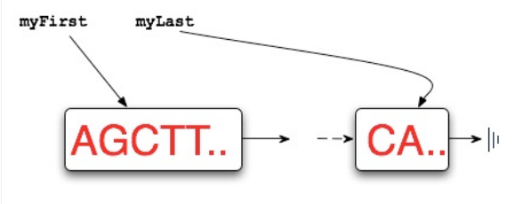

## DNA - Overview
---

<b>Note: Before you start coding, make sure to thoroughly read this assignment, look at the powerpoint on Sakai and watch the overview done by Arun. It will save you a lot of time. </b>

The goal of this assignment is to help you gain confidence with linked lists, get practice analyzing your code, and improve your understanding of tradeoffs, while learning to use important concepts like JUnit tests, inheritance, and much more.

## ASSIGNMENT OUTLINE:	   
	   
In	   this	   assignment	   you	   will	   you	   will	   experiment	   with	   different	   implementations	   of	   a	   simulated	   restriction	    enzyme	   cutting	    (or	    cleaving)	    a	    DNA	    molecule.	    You	    will	   complete	   several	   tasks:	

   
Benchmark	    the	    given	    code	    in	    SimpleStrand.cutAndSplice().	    This	   can	   be	   done	   with	   the	   DNABenchMark	   class.	   Your	   report	   must	   show	   that	   this	   algorithm/code	   is	   O(N)	   where	   N	   is	   the	   size	   of	   the	   returned	   strand.	

   
Test	   your	   benchmarking	   by	   running	   out	   of	   memory	   and	   then	   re-­?running	   the	   simulation	   with	   more	   memory.	   This	   will	   be	   in	   the	   report.	

   
Design,	    code,	    and	    test	    LinkStrand	    that	    implements	    IDnaStrand	    (like	   SimpleStrand).	   It	   should	   pass	   the	   tests	   in	   TestStrand.	   

4. Run	    experiments	    to	    show	    that	    LinkStrand	    is	    O(B)	    for	    a	    strand	    with	    B	   breaks	   as	   described	   below.	   

	   
### Introduction to DNA

In this assignment, we will be simulating restriction enzyme cutting of a DNA strand using code. To understand the theory behind this process, it is recommended (but not required) to read  [this](/dna/theory.html).

We are modeling DNA strands using classes implementing the interface IDnaStrand. See [IDnaStrand.java](/dna/code/IDnaStrand.html)
for more information on this interface. 

You are given a naive implementation called SimpleStrand, which stores the DNA strand as a String. The first part of the assignment is to benchmark the given code in SimpleStrand without writing any new code. This can be done with the DNABenchmark class. Then, we’ll test the benchmarking by changing the amount of memory required.

The main part of the project will be to implement LinkStrand, a more sophisticated version of a DNA strand that uses linked lists. This will include a nested node class as shown below: 

<b> Please type the following Node class inside your LinkStrand class! </b>

<code>

public class Node { 
  String myValue; 
  Node myNext;
  public Node(String s, Node link) {
    myValue = s;
    myNext = link;
  }
}

</code>

You will track these as private variables for beginning and the end of the linked list:
<code>
private Node myFirst, myLast;
</code>

Here is a picture to illustrate what myFirst and myLast represents:

You will also need to track the size of the linked list.
private int mySize;
where mySize returns the number of nucleotides in the LinkStrand (do not confuse this with the number of nodes!)
You can test correctness with the JUnit tests in TestStrand. You will also benchmark these implementations using the class DNABenchmark. We will then run more benchmarking experiments to show that our new version really is more efficient.
Here is the code for cutAndSplice for SimpleStrand with comments. You must fully understand how this method works for SimpleStrand to be able to implement it for LinkStrand

The following classes should be considered <b>READ-ONLY! </b> Please do NOT modify the following classes unless specified later:
<li> SimpleStrand.java : Do not change this class at all.</li>
<li> DNABenchmark.java : Only change it for benchmarking part 2. </li>
<li> IDnaStrand.java : Please do not change this at all. </li>
<li> TestStrand.java : Instead of changing this, you are encouraged to make your own JUnit tests in a separate class.</li>

=======
### Assignment Overview

In this assignment you will experiment with different implementations of a simulated restriction enzyme cutting (or cleaving) a DNA molecule. Refer to the [background theory](/dna/theory.html) for more information. You will complete four tasks:

<ol>
<li> Benchmark the given code in <code><a href="code/SimpleStrand.html">SimpleStrand</a>.cutAndSplice()</code>. This can be	done with the DNABenchMark class. Your report must show that this algorithm/code is O(N) where N is the	size of the returned strand.</li>
<li> Benchmark the amount of memory required by <code><a href="code/SimpleStrand.html">SimpleStrand</a></code> by varying the amount of memory allocated to the program.</li>
<li> Design, code, and test <code><a href="code/LinkStrand.html">LinkStrand</a></code> that implements <code><a href="code/IDNAStrand.html">IDNAStrand</a></code>. Your implementation should pass the JUnit tests in <code><a href="code/TestStrand.html">TestStrand</a></code>.</li>
<li> Run experiments to show that <code><a href="code/LinkStrand.html">LinkStrand</a></code> is O(B) for a strand with B breaks as described below.</li>
</ol>