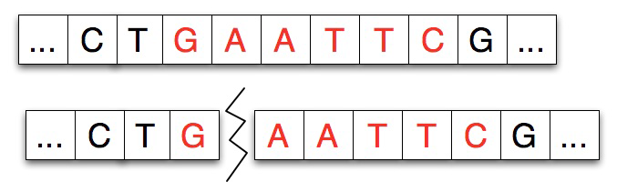

<h2>Restriction Enzyme Cleaving</h2>

<h3>The science behind the DNA Assignment</h3>

Restriction enzymes cut a strand of DNA at a specific location, the <em>binding site</em>, typically separating the DNA strand into two pieces. In the real chemical process a strand can be split into several pieces at multiple binding sites, we’ll simulate this by 
repeatedly dividing a strand.

Given a strand of DNA <code>aatccgaattcgtatc</code> and a restriction enzyme like EcoRI <code>gaattc</code>, the restriction enzyme locates each occurrence of its pattern in the DNA strand and divides the strand into two pieces at that point, leaving either blunt or sticky ends as described below. In the simulation there’s no difference between a blunt and sticky end, and we’ll use a single strand of DNA in the simulation rather than the double-helix/double-strand that’s found in the physical/real process.

Restriction enzymes have two properties or features: the pattern of DNA that marks 
a  site  at  which  separation  occurs  and  a  number/index  that  indicates  how  many 
characters/nucleotides of  the pattern attach  to  the left-part of  the split strand. For 
example, the adjacent diagram shows a strand split by EcoRI. The <em>pattern</em> for EcoRI 
is  <code>gaattc</code>  and  the  index  of  the  split  is  one  indicating  that  the  first 
nucleotide/character of the restriction enzyme adheres to the left part of the split. 

In some experiments, and in the simulation you’ll run, another strand of DNA will be 
spliced  into the  separated  strand.  The  strand  spliced  in  matches  the  separated 
strand  at  each  end  as  shown  in  the  diagram  below  where  the  spliced-in  strand 
matches with <code>G</code> on the left and <code>AATTC</code> on the right as you view the strands.

</body>

Your code will be a software simulation of this recombinant process: the restriction 
enzyme  will  cut  a  strand  of  DNA  and  new  DNA  will  be  spliced-in  to create  a 
recombinant  strand  of  DNA. <em>In  the  simulation  the  code  simply  replaces  every 
occurrence of the restriction enzyme with new genetic material/DNA — your 
code models the process with what is essentially string replacement.</em>
