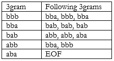
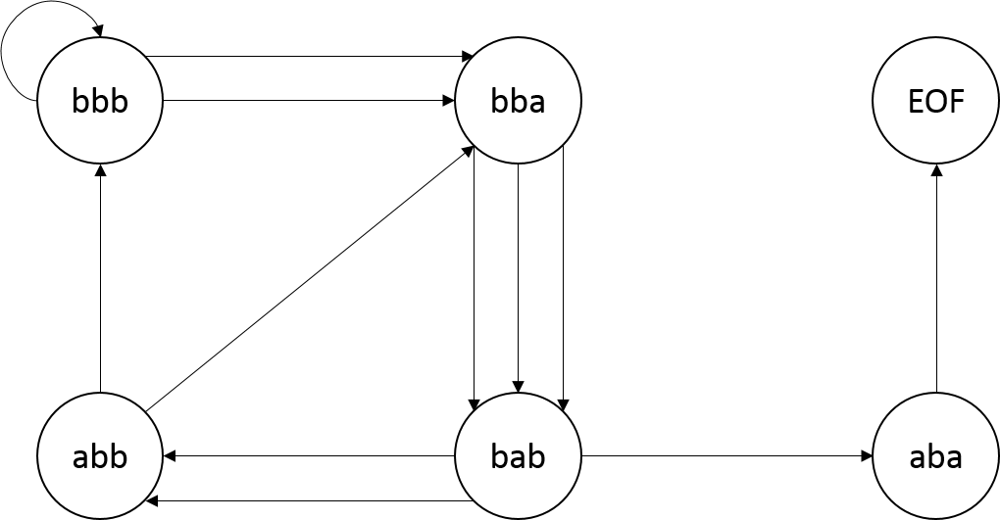

You’ll implement a class named MapMarkovModel that extends the abstract class AbstractModel. You should use the existing MarkovModel class to get ideas for your new MapMarkovModel class. <b>In order to be graded your MapMarkovModel should implement a <code>protected String makeNGram(int, int) </code> method like MarkovModel's which generates Ngrams.</b>

You can modify MarkovMain to use MapMarkovModel by simply changing one line. 

<pre><tt>  <b>public</b> <b>static</b> <b>void</b> main( String[] args) {
            IModel model = <b>new</b> MapMarkovModel(); // THE ONLY CHANGE
            SimpleViewer view = <b>new</b> SimpleViewer("Compsci 201 Markovian Text" +
                                                 " Generation", "k count&gt;");
            view.setModel(model);
  }</tt></pre>

Instead of scanning the training text N times to generate N random characters, you’ll first scan the text once to create a structure representing every possible k-gram used in an order-k Markov Model. You may want to build this structure in its own method before generating your N random characters. You should also note that <b>if you generate random text more than once with the same value of k, you will not need to regenerate this structure and doing so will cost you points.</b>

####Example
Suppose the training text is "bbbabbabbbbaba" and we’re using an order-3 Markov Model. 

The 3-letter string (3-gram) "bbb" occurs three times, twice followed by ‘a’ and once by ‘b’. We represent this by saying that the 3-gram "bbb" is followed twice by "bba" and once by "bbb". That is, the next 3-gram is formed by taking the last two characters of the seed 3-gram "bbb", which are "bb" and adding the letter that follows the original 3-gram seed. 

The 3-letter string "bba" occurs three times, each time followed by ‘b’. The 3-letter string “bab” occurs three times, followed twice by ‘b’ and once by ‘a’. What about the 3-letter string “aba”? It only occurs once, and it occurs at the end of the string, and thus is not followed by any characters. So, if our 3-gram is ever “aba” we will always end the text with that 3-gram. If instead, there were one instance of “aba” followed by a 'b' and another instance at the end of the text, then if our current 3-gram was “aba” we would have a 50% chance of ending the text. 

To represent this special case in our structure, we say that "aba" here is followed by an end-of-file (EOF) character. If while generating text, we randomly choose the end-of-file character to be our next character, then instead of actually adding a character to our text, we simply stop generating new text and return whatever text we currently have. For this assignment, to represent an end-of-file character we suggest you use the character whose integer value is 0, which can be generated using <code>((char) 0)</code> – see MarkovModel’s makeNgram method for a better idea of how to implement this.

In processing the training text from left-to-right we see the following transitions between 3-grams starting with the left-most 3-gram "bbb"

bbb -> bba -> bab -> abb -> bba -> bab -> abb ->bbb -> bbb -> bba -> bab -> aba

This can be represented as a map of each possible 3gram to the 3grams that follow it (or EOF if the 3gram is at the end): 

Or as a flow diagram (more formally known as a state diagram):

####Your Code

In your code you’ll replace the brute-force re-scanning algorithm for generating random text based on characters with code that builds a data structure that you’ll then use to follow the state transitions diagrammed above. Specifically, you’ll create a map to make the operation of creating random text more efficient. 

Keys in the map are k-grams in a k-order Markov model. The value associated with each key is a list of related k-grams. Each different k-gram in the training text will be a key in the map. The value associated with a k-gram key is a list of every k-gram that follows key in the training text. 

The list of k-grams that constitute a value should be in order of occurrence in the training text. That is, you should start generating your list of following grams from the beginning of your training text. See the table of 3-grams above as an example using the training text “bbbabbabbbbaba”. Note that the 3-gram key “bbb” would map to the list ["bba", "bbb", "bba"], the 3-gram key “bba”would map to the list ["bab", "bab", "bab"], and the 3-gram key “abb” would map to the list ["bba", "bbb"]

Just like in the brute method, to generate random text your code should generate an initial seed k-gram at random from the training text, exactly as in the brute-force approach. Then use the pseudo-code outlined below. 

<blockquote>
<pre class="code">
// (key) --- the initial seed 
seed = random k-character substring (k-gram) from the training text
repeat N times to generate N random letters
&nbsp;&nbsp;find the list (value) associated with seed (key) using the map
&nbsp;&nbsp;next-k-gram = choose a random k-gram from the list (value)
&nbsp;&nbsp;if next k-gram is EOF 
&nbsp;&nbsp;&nbsp;&nbsp;exit loop
 &nbsp;&nbsp;print or store C, the last character of next-k-gram
 &nbsp;&nbsp;seed = next-k-gram
 &nbsp;&nbsp;// Note this is (last k-1 characters of seed) + C
</pre>
</blockquote>

<b>Construct the map once — don’t construct the map each time the user tries to generate random text unless the value of k in the order-k Markov model has changed or the training text has changed.</b>

####Testing Your New Model

To test that your code is doing things faster and not differently you can use the same text file and the same markov-model. If you use the same seed in constructing the random number generator used in your new model, you should get the same text, but your code should be faster. <b>Do not change the given random seed.</b> If you do it may hurt you when your assignment is being graded. You’ll need to time the generation for several text files and several k-orders and record these times with your explanation for them in the Analysis you submit with this assignment. 

####Debugging Your Code

It’s hard enough to debug code without random effects making it harder. In the MarkovModel class you’re given the Random object used for random-number generation is constructed thusly: 

<code>
myRandom = new Random(RANDOM_SEED); 
</code>

RANDOM_SEED is defined to be 1234. Using the same seed to initialize the random number stream ensures that the same random numbers are generated each time you run the program. Removing RANDOM_SEED and using new Random() will result in a different set of random numbers, and thus different text, being generated each time you run the program. This is more amusing, but harder to debug. If you use a seed of RANDOM_SEED in your smart/Map model you should get the same random text as when the brute-force method is used. This will help you debug your program because you can check your results with those of the code you’re given which you can rely on as being correct. 

<b>When you submit your assignment, your code should use RANDOM_SEED as the argument to the Random. If you don’t, you will fail some of the automated tests. </b>
