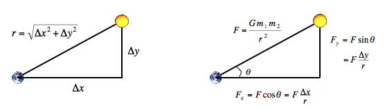

###The physics
t
We review the equations governing the motion of the particles according to Newton's laws of motion and gravitation. Don't worry if your grounding in physics is a bit rusty or even nonexistent; all of the necessary formulas are included below. We'll assume for now that the position <i>(px, py)</i> and velocity <i>(vx, vy)</i> of each particle is known. In order to model the dynamics of the system, we must know the <em>net force</em> exerted on each particle.

<ul>
<li>
Pairwise force

Newton's law of universal gravitation asserts that the strength of the gravitational force between two particles is given by the product of their masses divided by the square of the distance between them, scaled by the gravitational constant G (6.67 × 10-11 N m2 / kg2). The pull of one particle towards another acts on the line between them. Since we are using Cartesian coordinates to represent the position of a particle, it is convenient to break up the force into its x and y components (Fx, Fy) as illustrated below.
</li>

<li> 
Net force

The principle of superposition says that the net force acting on a particle in the x or y direction is the sum of the pairwise forces acting on the particle in that direction.
</li>

<li>
Acceleration

Newton's second law of motion postulates that the accelerations in the x and y directions are given by: ax = Fx / m, ay = Fy / m. 
</li>
</ul>

###The numerics

We use the <i>leapfrog finite difference approximation scheme</i> to numerically integrate the above equations: this is the basis for most astrophysical simulations of gravitational systems. In the leapfrog scheme, we discretize time, and update the time variable t in increments of the time quantum Δt. We maintain the position (px, py) and velocity (vx, vy) of each particle at each time step. The steps below illustrate how to evolve the positions and velocities of the particles.

1. <strong>Calculate forces</strong> For each particle: 

  a. Calculate the net force (Fx, Fy) at the current time t acting on that particle using Newton's law of gravitation and the principle of superposition.

2. <strong>Update positions, velocities, and acceleration</strong> For each particle:

  a. Calculate its acceleration (ax, ay) at time t using the net force computed in Step 1 and Newton's second law of motion: ax = Fx / m, ay = Fy / m.

  b. Calculate its new velocity (vx, vy) at the next time step by using the acceleration computed in Step 2a and the velocity from the old time step: Assuming the acceleration remains constant in this interval, the new velocity is (vx + Δt * ax, vy + Δt * ay).

  c. Calculate its new position (px, py) at time t + Δt by using the velocity computed in Step 2b and its old position at time t: Assuming the velocity remains constant in this interval, the new position is (px + Δt * vx, py + Δt * vy).

3.  <strong>Display update</strong>  For each particle: 
  a. Draw it using the position computed in the previous step.

The simulation is more accurate when Δt is very small, but this comes at the price of more computation. The default Δt we use is 25,000, which achieves a reasonable balance.
