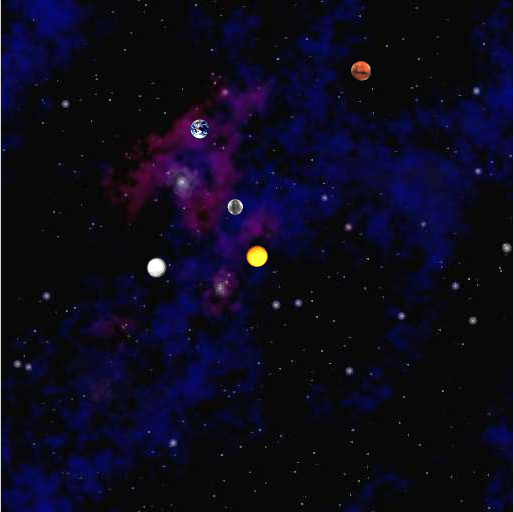

####Possible Plan
We suggest you implement the algorithm for `positions` in the following steps.

<ol>
<li>Read in the data file planets.txt using the <a href="http://docs.oracle.com/javase/8/docs/api/java/util/Scanner.html">Scanner</a> provided by the method arguments and store the information in six arrays. Use Scanner's <code>next()</code> method to get the next word, <code>nextInt()</code> to get the next integer, and <code>nextDouble()</code> to get the next real number.

Each input file contains the information for a particular universe. The first value is an integer N which represents the number of particles. The second value is a real number R which represents the radius of the universe. Finally, there are N rows, and each row contains 6 values. The first two values are the x- and y-coordinates of the initial position; the second two values are the x- and y-coordinates of the initial velocity; the next value is the mass; the last value is a String that is the name of an image file used to display the particle. As an example, the input file planets.txt contains data for the inner planets of our solar system (in SI units):

<samp>
5  
2.50e11  
1.496e11 0.000e00 0.000e00 2.980e04 5.974e24 earth.gif  
2.279e11 0.000e00 0.000e00 2.410e04 6.419e23 mars.gif  
5.790e10 0.000e00 0.000e00 4.790e04 3.302e23 mercury.gif  
0.000e00 0.000e00 0.000e00 0.000e00 1.989e30 sun.gif  
1.082e11 0.000e00 0.000e00 3.500e04 4.869e24 venus.gif  
</samp>

Let <code>px[i], py[i], vx[i], vy[i]</code>, and <code>mass[i]</code> be real numbers which store the current position (x and y coordinates), velocity (x and y components), and mass of planet i. Let <code>image[i]</code> be a string which represents the filename of the image used to display planet i. Keep in mind that some submissions have comments at the end - be sure you read only N lines of input instead of reading until the end of the file.
</li>

<strong>Do not even think of continuing until you have checked that you read in the data correctly</strong>. To test, print the information back out using <code>System.out.println()</code>.
</li>

<li> 
Plot the background starfield.jpg image. Note that <code>StdDraw.picture(x, y, file)</code> centers the picture on (x, y). Use <code>StdDraw.setXscale(-R, R)</code> and <code>StdDraw.setYscale(-R, R)</code> to set the boundaries of the simulation. Test that it works. Now, write a loop to plot the N bodies. If all goes correctly, you should see the four stationary planets and the sun. Now, go and test it on another data file.
</li>

<li>
Write a loop to calculate the new velocity and position for each body using <code>timeStep</code> (This code goes before the plotting code you wrote in the previous step). Since we haven't yet incorporated gravity, assume the acceleration acting on each planet is zero. 

</li>

<li>
Add an outer loop to repeat the previous two steps for the duration of <code>totalTime</code>. 

To create the illusion of movement, we need to plot each particle at its current position using the <code>StdDraw.picture</code> method and display this sequence of snapshots (or frames) in rapid succession. So, after each time step:
<ol>
<li>draw the background image starfield.jpg, </li>
<li>redraw all the bodies in their new positions, and </li>
<li>control the animation speed using <code><a href="http://www.cs.princeton.edu/introcs/stdlib/javadoc/StdDraw.html#show(int)">StdDraw.show()</a></code>. </li>
</ol>

Test your animation. You should now see the four planets moving off the screen in a straight line, with constant velocity. Test it on another data file to be sure.
</li>

<li>
Now, calculate the net force acting on each body. You will need two additional arrays <code>fx[i]</code> and <code>fy[i]</code> to store the net force acting on  planet i. First, complete the <code>distance()</code> and <code>force()</code> methods. Next, within <code>positions()</code>, write a loop to initialize all the net forces to 0.0. Then write two nested for loops to calculate the net force exerted by planet j on planet i. (Note: refer to the <a href="http://compsci201.github.io/nbody/1-physics.html">Equations page</a> for the math.) Add these values to fx[i] and fy[i], but skip the case when i equals j. Once you have these values computed, you can use them to compute the acceleration (instead of assuming it is zero). Test your program on several data files.
</li>

<li>
Your method should finish by returning a 2D array of doubles containing the x and y-positions of the *n* bodies. When you snarf the project, the method <code>positions()</code> comes with commented instructions on how to return the array in the format the grader expects.

<li>
When you've finished, you can test if your program works correctly by running it on planets.txt. If you are using the default values time = 10,000,000 and Δt = 25,000, the simulation should show four planets orbiting the sun and stop in this position:  

  

and should produce [this animation](http://www.cs.duke.edu/courses/cps100e/spring10/assign/nbody/nbody-planets.mov).
</li>

<li>To make the viewing experience more enjoyable, uncomment the commented line in <code>start()</code> to play the theme to 2001: A Space Odyssey using <code>StdAudio</code> and the file 2001.mid. You can also have the program instead play the theme to Superman using superman.mid. </li>

</ol>

###Your analysis

In your README.txt, you will answer two questions about the simulation of the bodies described in planets.txt.

<ol>
<li>What is the final position of the planets after 1,000,000 seconds with a timestep (i.e. Δt) of 25,000?  </li>
<li>For what values of <code>timeStep</code> (e.g., Δt > T), does the simulation no longer behave correctly? That is, the planets planets no longer follow their orbits around the Sun. Explain how you arrived at your answer.</li>
</ol>
