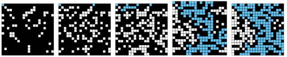

Your completed `PercolationVisualizer` should prompt the user for N and display the
percolation process starting with a N-by-N grid of sites (initially all blocked and [black](http://www.cs.duke.edu/csed/java/jdk1.6/api/java/awt/Color.html#BLACK)). After each site is opened, display full sites in [cyan](http://www.cs.duke.edu/csed/java/jdk1.6/api/java/awt/Color.html#CYAN), open sites (that aren't full) in [white](http://www.cs.duke.edu/csed/java/jdk1.6/api/java/awt/Color.html#WHITE), and blocked sites in black using [princeton.StdDraw](http://www.cs.princeton.edu/introcs/15inout/javadoc/StdDraw.html). Here is an example of steps in a visualization on a 20x20 grid as in this [movie](http://www.cs.princeton.edu/courses/archive/spring11/cos226/assignments/percolation20-by-20-f11.mov) and the following snapshots. 

#####Going from 50 to 100 to 150 to 204 to 250 open sites in a 20x20 grid.