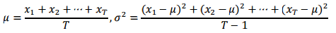

To estimate the percolation threshold, perform the following computational experiment on a percolation object:

<ol>
<li>Initialize all sites to be blocked.</li>
<li>Repeat the following until the system percolates:
<ol>
<li>Choose a blocked site (row i, column j) uniformly at random among all blocked
sites.</li>
<li>Open the site (row i, column j).</li>
</ol></li>
<li>The fraction of sites that are now opened provides an estimate of the percolation threshold.</li>
</ol>

To obtain an accurate estimate of the percolation threshold, repeat the experiment <i>T</i> times and average the results. Let xt be the fraction of open sites in experiment <i>t</i>. The sample mean, μ, provides an estimate of the percolation threshold. The sample standard deviation, σ, measures the sharpness of the threshold. You can calculate these values as follows (notice the right formula is for σ2): 

Assuming T is sufficiently large (say, at least 30), the following provides a 95% confidence interval for the percolation threshold:

Write a client program <code>[PercolationStats](http://www.cs.duke.edu/courses/compsci201/fall14/assign/percolation/code/PercolationStats.html)</code> that prompts the user for <i>N</i> and <i>T</i>, performs <i>T</i> independent experiments on an <i>N</i>-by-<i>N</i> grid, and prints out the 95% confidence interval for the percolation threshold. Use <code>[java.util.Random](http://docs.oracle.com/javase/8/docs/api/java/util/Random.html)</code> to generate random numbers and follow steps above to compute the sample mean and standard deviation. Below is an example run with <i>N</i>=200 and <i>T</i>=100.

<code>
mean percolation threshold = 0.5921 
stddev = 0.0098 
95% confidence interval = [0.5902, 0.5940] 
total time = 2.074s 
mean time per experiment = 0.02074 
stddev = 0.00376
</code>