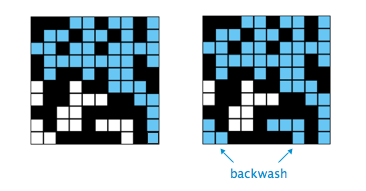

####What should I read prior to writing code: 

Most of the code in this assignment comes from discussion in the text and supplementary reading. Please review the following:
<ul>
<li> [Section 2.4](http://introcs.cs.princeton.edu/24percolation/) in <em>Introduction to Programming in Java</em> by Robert Sedgewick & Kevin Wayne</li>

<li>Sedgewick & Wayne's [union-find case study](http://algs4.cs.princeton.edu/15uf/) or the [following excerpt](http://www.cs.princeton.edu/courses/archive/fall09/cos226/handouts/Algs3Ch1.pdf) from <em>Algorithms</em>, 3rd Edition</li>

<li> API documentation for [princeton.StdDraw](http://introcs.cs.princeton.edu/java/stdlib/javadoc/StdDraw.html)

<li> Optional: If you'd like to understand the theory behind the complexity of union-find operations in detail, read [these notes](http://www.cs.princeton.edu/courses/archive/fall10/cos226/precepts/15UnionFind-Tarjan.pdf) from Robert Tarjan
</ul>

####What should stddev() return if T equals 1? 

The sample standard deviation is undefined. We recommend returning <code>Double.NaN</code> (Not-A-Number).

####After the system has percolated, my PercolationVisualizer colors in cyan all sites connected to open sites on the bottom (in addition to those connected to open sites on the top). Is this backwash OK? 

Yes, we won't deduct for that for PercolationUF (PercolationDFS should not have backwash, if it does there's a major error). You can think of the water as filling back up from the bottom. 

If you finish early, you can try to eliminate backwash without using a second union-find structure or worsening the runtime's order of growth for extra credit.  Our tests for PercolationUF compare your grid to both an IPercolate implementation which removes backwash and one which does not. Thus, whether or not you implement backwash should not affect your correctness score.

Your solution to eliminate backwash should be isolated within PercolationUF - that is, it should be independent of the IUnionFind implementation used and the visualizer. In addition, the Big-Oh runtime of every method should not increase as a result of implementing backwash removal, otherwise you will fail the engineering tests.

####How efficient should the methods in PercolationUF be?

For a NxN grid, the construction should take N2 time; the other methods should take time at most logarithmic in N.

####How do I generate a random blocked site? 

Create a list of all blocked sites. [Shuffle](http://docs.oracle.com/javase/8/docs/api/java/util/Collections.html#shuffle-java.util.List-java.util.Random-) the list at the beginning and then each step pick the next element from the list.

####How many bytes does a data structure need?

In
computing the memory required, you should be most concerned about the
number of values stored. 
An <tt>int</tt> uses 4 bytes. A <tt>double</tt> requires 8 bytes. 
