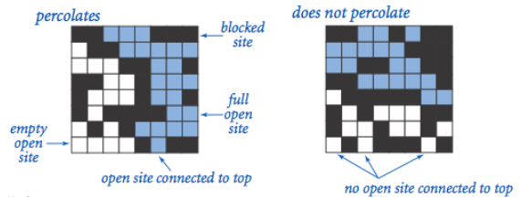
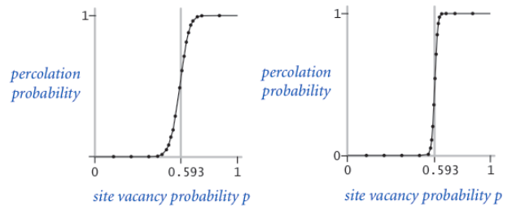

##Percolation - Overview
---

Welcome to the Percolation assignment. In this assignment, you will write a program to estimate the value of the [percolation threshold](http://en.wikipedia.org/wiki/Percolation_thresholds) via [Monte Carlo](http://en.wikipedia.org/wiki/Monte_Carlo_method) simulation. In doing so, you will better understand depth-first-search, union-find structures, and the use of computer simulations for statistical inquiry.

[Here](/percolation/printer-friendly) is a printer friendly version of this assignment.

The code for this assignment is available through Snarf (using [Ambient](https://www.cs.duke.edu/csed/ambient/)).

###Acknowledgements

The [assignment](http://www.cs.princeton.edu/courses/archive/fall14/cos226/assignments/percolation.html) was developed by [Kevin Wayne](http://www.cs.princeton.edu/~wayne) at Princeton University for their Computer Science 226 class. 

###Introduction

Given a composite systems comprised of randomly distributed insulating and metallic materials: what fraction of the materials need to be metallic so that the composite system is an electrical conductor? Given a porous landscape with water on the surface (or oil below), under what conditions will the water be able to drain through to the bottom (or the oil to gush through to the surface)? Scientists have defined an abstract process known as percolation to model such situations.

###The Model

We model a percolation system using an N-by-N grid of sites. Each site is
either open or blocked. A full site is an open site that can be connected to an open site
in the top row via a chain of neighboring (left, right, up, down) open sites. We say the
system percolates if there is a full site in the bottom row. In other words, a system
percolates if we fill all open sites connected to the top row and that process fills some
open site on the bottom row. (For the insulating/metallic materials example, the open
sites correspond to metallic materials, so that a system that percolates has a metallic
path from top to bottom, with full sites conducting. For the porous substance example,
the open sites correspond to empty space through which water might flow, so that a
system that percolates lets water fill open sites, flowing from top to bottom.)

In a famous scientific problem, researchers are interested in the following question: if sites
are independently set to be open with probability p (and therefore blocked with
probability 1 − p), what is the probability that the system percolates? When p equals 0, the
system does not percolate; when p equals 1, the system percolates. The plots below show 
the site vacancy probability p versus the percolation probability for 20-by-20 random grid
(left) and 100-by-100 random grid (right).

When N is sufficiently large, there is a threshold value p* such that when p < p* a random N-by-N
grid almost never percolates, and when p > p*, a random N-by-N grid almost always
percolates. No mathematical solution for determining the percolation threshold has yet been derived. 

###The Assignment
Your task is to write a program to:
<ul>
<li>Visualize the percolation process</li>
<li>Estimate p* for a square grid percolation model</li>
<li>Compare brute force (depth-first search) to union-find for finding connected open
sites</li>
</ul>

You need to write code for the following classes:

[PercolationDFS.java](http://www.cs.duke.edu/courses/compsci201/fall14/assign/percolation/code/PercolationDFS.html): This class implements the brute force method for
percolation. <b>Please refer to [Section 2.4](http://introcs.cs.princeton.edu/java/24percolation) in the <i>Introduction to Programming in
Java.</i></b> You will complete the following methods: 
<ul>
<li>constructor: initialize a grid of size <i>n</i> </li>
<li><code>open</code>: open a particular grid cell </li>
<li><code>isOpen</code> & <code>isFull</code>: give current state of grid cell </li>
<li><code>percolates</code> and <code>dfs</code>: determine whether current grid will percolate by
implementing recursive scheme depth-first search as discussed in class and
the textbook  </li></ul>

[PercolationVisualizer.java](http://www.cs.duke.edu/courses/compsci201/fall14/assign/percolation/code/PercolationVisualizer.html): complete main so that it repeatedly calls a
percolator (i.e., something that implements `IPercolate` like `PercolationDFS`) to
declare sites open, draw, and pause until the system percolates 

[PercolationUF.java](http://www.cs.duke.edu/courses/compsci201/fall14/assign/percolation/code/PercolationUF.html): You will implement a more efficient solution that can use
any union-find algorithm that implements `IUnionFind` (e.g., `QuickFind.java`). You will complete the following methods:

<ul>
<li>constructor: initialize a grid of size <i>n</i> and union-find algorithm</li>
<li><code>open</code>: open a particular grid cell and merge components as appropriate</li>
<li><code>isOpen</code> & <code>isFull</code>: give current state of grid cell</li>
<li><code>getIndex</code>: return an index that uniquely identifies (row, col), so that each
grid square can be in its own set at the beginning</li>
<li><code>percolates</code>: determine whether top and bottom are connected (i.e., in the
same component)</li>
</ul>

QuickUWPC.java: A class that implements the weighted quick union with path
compression data structure. See the Sedgewick & Wayne [case study](http://algs4.cs.princeton.edu/15uf/) or the [following
reading](http://www.cs.princeton.edu/courses/archive/fall09/cos226/handouts/Algs3Ch1.pdf) for more information. You will need to create this file by adapting
[WeightedQuickUnionUF.java](http://algs4.cs.princeton.edu/15uf/WeightedQuickUnionUF.java.html) to implement the IUnionFind interface. 

[PercolationStats.java](http://www.cs.duke.edu/courses/compsci201/fall14/assign/percolation/code/PercolationStats.html): A class that prompts for *N* and *T*, performs *T* experiments on an <i>N</i>x<i>N</i>
grid, and prints the mean, standard deviation, and confidence interval of the percolation threshold, and timings of percolation simulations.